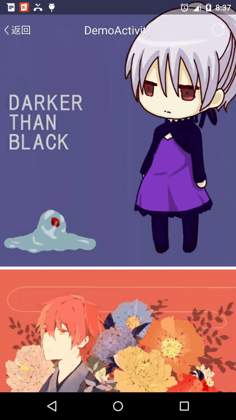
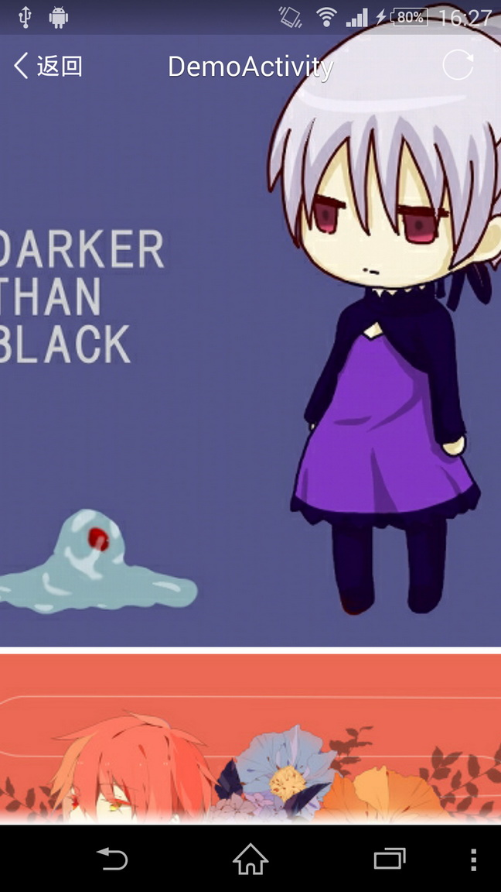
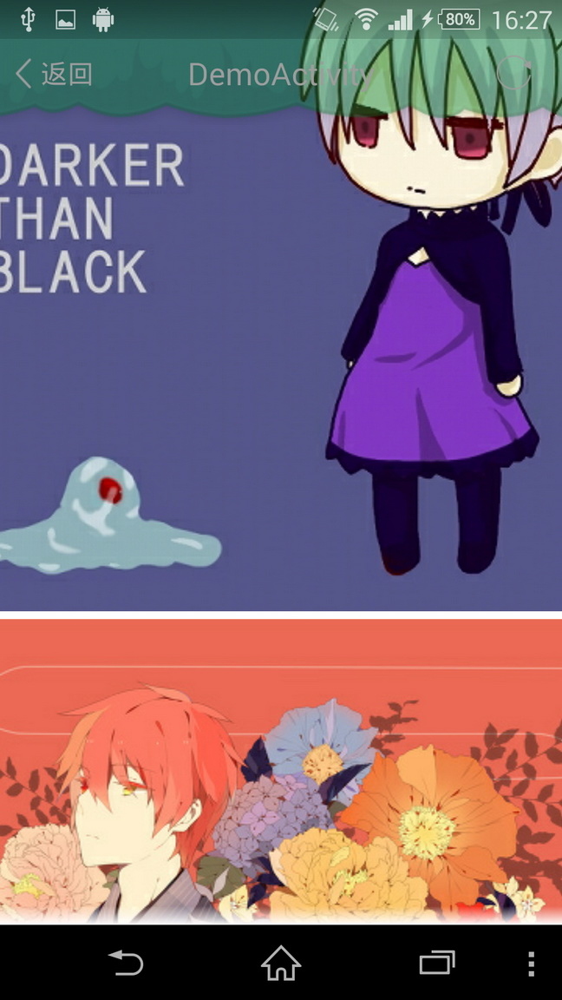
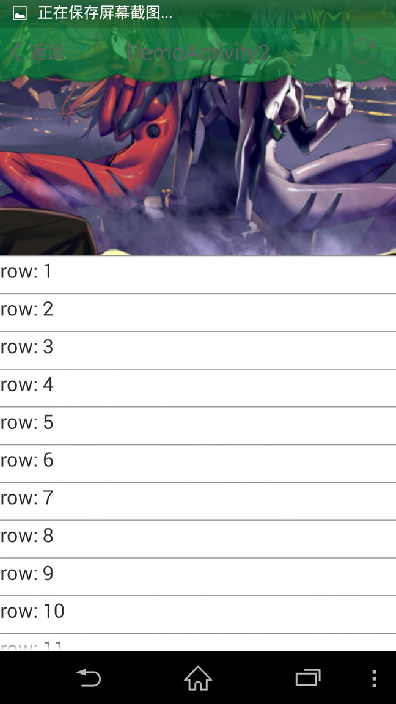

# InterestingTitleBar
Interesting android title bar with immersive status bar and scroll animation like tumblr app.



Pre-requisites
--------------

- Android SDK v8

Immersive window modes
-----------

Different from SystemBarTint project, this titlebar project doesn't require android:fitsSystemWindows="true", and it does all padding work for you.

How-to
--------------
You may check the demo activity to see its usage, but nomally:

```java
CustomTitleBar bar = (CustomTitleBar) findViewById(R.id.title_bar);
bar.setTitleTextView((TextView)bar.findViewById(R.id.bar_title));
bar.setTransparentEnabled(true, 100, 600);
bar.setTitle("DemoActivity");
bar.setTextShadowColor(getResources().getColor(R.color.bar_title_text_shadow));
bar.addViewToFadeList(findViewById(R.id.bar_left_button));
bar.addViewToFadeList(findViewById(R.id.bar_right_button));
bar.addViewToFadeList(findViewById(R.id.bar_title));
```

What if fitsSystemWindows is true (should set clipToPadding to false)
```java
bar.setTitleBarFitsSystemWindows(true);
```
The bar will do drawing of shadow on status bar for you.

TODO
-----------
1. More animation.
2. Better support for immersive titlebar.
3. Material design support.

Screenshots
-----------




